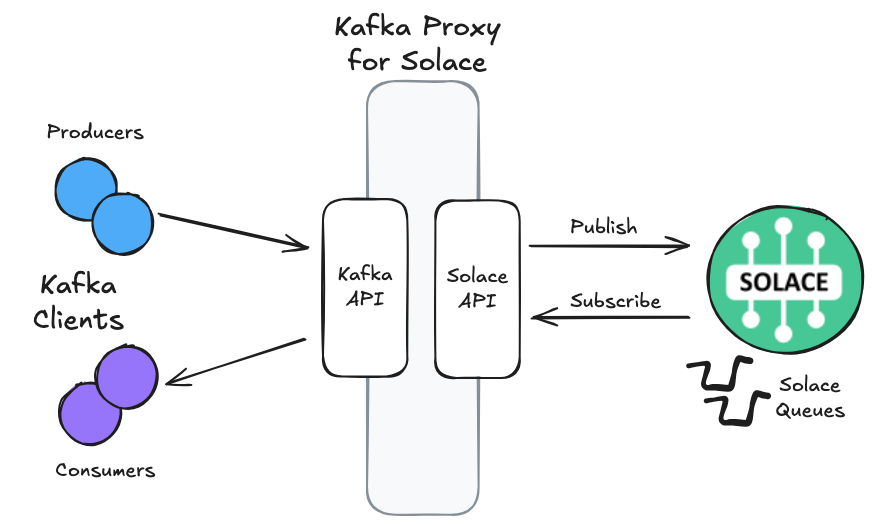

author: Dennis Brinley
summary: Execute Kafka Wireline Proxy and publish and consume messages from Solace broker using Kafka clients
id: kafka-proxy-quickstart
tags: Solace, Kafka, proxy 
categories: Solace, Kafka, Java
environments: Web
status: Draft
feedback link: https://github.com/SolaceDev/solace-dev-codelabs/blob/master/markdown/kafka-proxy-quickstart

# Kafka Proxy for Solace: Quickstart

## What you'll learn: Overview

Duration: 0:05:00

This codelab will guide you through the steps necessary to start up an instance of the Kafka Proxy on your desktop and then use Kafka clients to publish/consume messages to a Solace broker. No Kafka cluster is required! The proxy will appear to the clients as Kafka, with the Solace broker providing the message capability.

### What the proxy does

The Kafka Proxy for Solace allows Kafka clients to publish and subscribe to a Solace Event Broker without any changes to the Kafka client application. Only configuration changes to client apps are required. The proxy speaks the native Kafka wireline protocol to Kafka client applications and the Solace SMF protocol to the Event Brokers.



The proxy code can be found here: [Kafka Client Proxy to Solace](https://github.com/SolaceLabs/kafka-client-proxy-to-solace)

### Upon completion of the code lab, you should be able to:
- Configure and start a Kafka Proxy instance from a pre-built JAR, built-from-source JAR, or Docker container
- Configure a Solace broker with the necessary queues and permissions
- Connect Kafka producer clients and publish messages to Solace via the proxy
- Connect Kafka consumer clients and consume messages from Solace via the proxy
- Understand basic proxy configuration options and queue mapping strategies

## What you need: Prerequisites

Duration: 0:07:00

### Required Software
- **Java 17+** - Runtime required to run the proxy and sample Kafka clients
- **Git Client** (optional) - Only needed if building the proxy from source (or sample clients)
- **Solace Broker Instance** - See below for additional requirements

### Optional Software  
- **Maven 3.6+** - Only needed if building the proxy or sample clients from source
- **[Docker Desktop](https://docs.docker.com/desktop/setup/install/mac-install/) or [Podman](https://podman.io/docs/installation)** - Only needed if running the proxy as a container

### Solace Broker Requirements
Some familiarity with Solace brokers, broker administration, and Event-Driven architecture with pub-sub messaging and queues is strongly recommended.

- **Broker Instance** - This can be a local Docker instance, Software broker on your network, Solace appliance, or Solace Cloud service
- **Administrative Access** - You will need to create queues and configure client users
- **Client Credentials** - Username/password for client authentication. The proxy delegates authentication to Solace. Only Basic Auth is supported at this time.
- **Client Permissions** - The client user must have permission to:
    - Publish messages to topics (or ACL profile with topic exceptions)
    - Consume messages from queues that will be created for this codelab

### Solace Broker Quick Start Option
If you don't have a Solace broker available, you can quickly spin up a local instance using Docker (or Podman). ***Recommended if you don't have access including administrative rights to an existing broker***

```bash
docker run -d -p 8081:8080 -p 55554:55555 --shm-size=2g --env username_admin_globalaccesslevel=admin --env username_admin_password=admin --name=solace solace/solace-pubsub-standard
```

> aside negative
> If using **Podman**, you will need to set the machine to run in rootful mode prior to starting. Execute command: `podman machine set --rootful` prior to starting the podman machine.

> aside negative
> The default unprotected tcp port for a Solace broker is `55555`. This is a reserved port on MacOS. Therefore, the port is mapped to `55554` outside of the Docker container.

> aside negative
> The default unprotected port for the Solace management console is `8080`. This port is mapped to `8081` outside of the container to prevent a port conflict with kafka proxy healthcheck port.

## Configure Solace Broker

Duration: 0:10:00

> aside positive
> This section assumes your Solace broker is running and accessible. If using the Docker command from the prerequisites, your broker will be available at `http://localhost:8080` (admin user: `admin`, password: `admin`).

### Access Solace PubSub+ Manager

1. Open your browser and navigate to your Solace PubSub+ Manager interface
2. Log in with your administrative credentials
3. Navigate to your Message VPN (default is often `default` for local instances)

### Create ACL Profile

The ACL profile controls where a client can connect from and what topics and queues the client can access.

> aside positive
> If this is a new cloud instance or a dev instance that you are running locally on your desktop, you can skip this step. Simply select `default` ACL profile when creating your client user. The `default` profile has open access. Otherwise, you will need to complete the following steps.

**Create an ACL profile:**
1. Navigate to **Access Control > ACL Profiles**
2. Click **+ ACL Profile** to create a new profile
3. Enter name: `kafka-client-acl`
4. Under **Client Connect** tab, click **Edit**, then set **Connect Default** to `Allow`
5. Click **Apply**
6. Under **Publish Topic**, **Publish Default Action** will be `Disallow` for a new profile. Add an exception to allow our client to publish:
   - Enter the value: `>`
   - This value will allow the client to publish to any topic
7. Click **Apply**


> aside negative
> **Security Note**: The `>` wildcard grants broad permissions and is suitable for development. In production, use more restrictive topic patterns based on your application needs.

### Create Client Profile

The client user needs appropriate permissions to publish and consume messages. Specifically, the 

> aside positive
> If this is a new cloud instance or a dev instance that you are running locally on your desktop, you can skip this step. Simply select `default` Client Profile when creating your client user. The `default` client profile will allow the client to publish and subscribe guaranteed messages. Otherwise, you will need to complete the following steps.

1. Under **Access Control**, select **Client Profiles**
2. Click **+ Client Profile** to create a profile and name it `kafka-client-profile`
3. This will open **Client Profile Settings** page. Switch on **Send Guaranteed Messages** and **Receive Guaranteed Messages**
4. Click **Apply** to save the new client profile

### Create Client User

1. Navigate to **Access Control > Client Usernames**
2. Click **+ Client Username** to create a new user
3. Enter the username: `kafka-client` and click **Create**. This will open the **Client Username Settings** page
4. **Enable** the client username by switch to `On`
5. Click **Change Password** and set the password to: `kafka-password` (or some value known to you)
6. If you created Client Profile `kafka-client-profile` then select it from the dropdown. Otherwise leave as `default`
7. If you created ACL Profile `kafka-client-acl` then select it from the dropdown. Otherwise leave as `default`
8. Click **Apply** to save your changes

### Create Queue
The Kafka consumer will subscribe to this queue via the proxy. 

1. Navigate to **Queues** and select **+ Queue** to create a queue
2. Set the queue name to `KAFKA-PROXY-QUEUE/KAFKA_TOPIC/GROUP1`
3. Set **Access Type** to `Non-Exclusive`
4. **Partition Count** to `10`
5. You can leave **Owner** blank if **Non-Owner Permission**=`Consume`. Otherwise, select your client user from the dropdown.

### Create Queue Subscriptions
Solace queues attract messages published to the broker using subscriptions. We need to add a subscription to the queue so that published messages are added to the queue for consumption.

1. Under **Queues**, select the queue `KAFKA-PROXY-QUEUE/KAFKA_TOPIC/GROUP1`
2. Go to the **Subscriptions** tab and click **+ Subscription**
3. Add subscription value `KAFKA/TOPIC` and click **Create**

### 💡🎓 Things to know about queue names and the Kafka Proxy
- The proxy determines which Solace queue to consume from based upon the name of the subscribed topic and consumer group configured for the Kafka client.
- Expected Queue names have the form: `Proxy-Prefix/Subscribed-Topic/Consumer-Group` where:
- **Proxy-Prefix** : A value that is prepended to the expected queue name. This value is configurable on the proxy. We will set queue name prefix to `KAFKA-PROXY-QUEUE` when we configure the proxy in the next step
- **Subscribed-Topic**: Topic name subscribed by the Kafka consumer
- **Consumer-Group**: The name of the consumer group specified by the consumer

**Queue Name Example:**
- A Kafka consumer connects to the proxy and subscribes to topic=`KAFKA_TOPIC` as a member of consumer group=`MYGROUP`. 
- The proxy queue prefix is set to `KPROXY`. 
- The client will therefore attempt to bind to queue named: `KPROXY/KAFKA_TOPIC/MYGROUP`

## Get and Start the Kafka Proxy

Duration: 0:15:00

You have three options to obtain and run the Kafka Proxy. Choose the method that works best for your environment.

### Option 1: Download Pre-built JAR (Recommended)

The easiest way to get started is with a pre-built JAR file.

1. Visit the [Releases page](https://github.com/SolaceLabs/kafka-client-proxy-to-solace/releases) of the project
2. Find the latest release and download the attached `kafka-wireline-proxy-*.jar` file
3. Save it to your working directory

### Option 2: Build from Source

If you prefer to build from source or need the latest development version:

```bash
# Clone the repository
git clone "https://github.com/SolaceLabs/kafka-client-proxy-to-solace.git"
cd kafka-client-proxy-to-solace

# Build with Maven
mvn clean package -DskipTests=true

# The JAR will be created at: target/kafka-wireline-proxy-*.jar
```

### Option 3: Use Docker Container

Pull the image for containerized deployment:

```bash
docker pull ghcr.io/solacelabs/kafka-client-proxy-to-solace:latest
```

### Create Proxy Configuration

The proxy accepts a single argument for a properties file for run-time configuration (aside from Java options). Create a file called `proxy-config.properties` in your working directory and add the following content. You will likely need to update the broker connection details. 

```properties
# Kafka client listener (where Kafka clients connect)
listeners=PLAINTEXT://localhost:9092

# Solace broker connection (update these values for your broker)
solace.host=tcp://localhost:55554
solace.vpn_name=default

# Proxy-wide settings
proxy.healthcheckserver.create=true
proxy.healthcheckserver.port=8080

# Producer settings
proxy.separators=_.
message.max.bytes=1048576

# Consumer settings
proxy.request.handler.threads=32
proxy.partitions.per.topic=50
proxy.queuename.qualifier=KAFKA-PROXY-QUEUE
proxy.queuename.is.topicname=false
proxy.fetch.compression.type=none
proxy.max.uncommitted.messages=1000
```

> aside positive
> **Configuration Notes**: 
> - Update `solace.host` to match your broker (e.g., `tcps://your-broker.solace.cloud:55443` for the protected port on Solace Cloud)
> - Update `solace.vpn_name` to match your Message VPN name
> - Client credentials are configured in the Kafka clients, not in the proxy configuration

### Start the Proxy

These commands will start the proxy on your desktop.

**Run the proxy using the JAR file (Options 1 & 2):**

```bash
# Start the proxy
java -jar kafka-wireline-proxy-*.jar proxy-config.properties
```

You should see output similar to:

```log
15:50:28.636 [main] INFO  HealthCheckServer - Health check server started on port 8080
15:50:28.652 [main] INFO  ProxyReactor - Listening for incoming connections on PLAINTEXT localhost/127.0.0.1:9092
15:50:28.791 [main] INFO  ProxyReactor - Initializing request handler thread pool with 32 threads.
```

**Run the proxy as a container (Option 3):**

```bash
# Pull and run the pre-built container
docker run -d \
  --name kafka-proxy \
  -p 9092:9092 \
  -p 8080:8080 \
  -v $(pwd)/proxy-config.properties:/app/proxy-config.properties \
  ghcr.io/solacelabs/kafka-client-proxy-to-solace:latest
```

> aside positive
> The proxy is now ready to accept Kafka client connections on port 9092! Keep this terminal open - we'll need the proxy running for the next steps.

> aside positive
> - The healthcheck server port `8080` will be active if you use the config content above as given. Proxy availabability can be tested by running command `curl http://localhost:8080`

## Build and Configure Kafka Clients

Duration: 0:10:00

The proxy project includes sample Kafka producer and consumer clients that we'll use for testing. You may opt to download or build the sample clients.

### Option 1: Download Download from Release

If you downloaded the pre-built proxy JAR in the previous step, you'll also need the demo client JARs:
- Look for `kafka-demo-producer-*.jar` and `kafka-demo-consumer-*.jar` in **Assets** section under the most recent release in the [Kafka Client Proxy to Solace](https://github.com/SolaceLabs/kafka-client-proxy-to-solace/releases) project.
- Download these files into a working directory

### Option 2: Build the Demo Clients from source

```bash
# If you haven't already, clone the repository
git clone https://github.com/SolaceLabs/kafka-client-proxy-to-solace.git
cd kafka-client-proxy-to-solace

# Build the demo clients
mvn clean package -f demo-producer/pom.xml
mvn clean package -f demo-consumer/pom.xml

# This creates:
# demo-producer/target/kafka-demo-producer-*.jar
# demo-consumer/target/kafka-demo-consumer-*.jar
```

Copy the client jar files into a working directory.

### Create Producer Configuration

In your working directory with jar file(s), create a file called `demo-producer.properties` and add the following content:

```properties
# Proxy connection (not a real Kafka broker)
bootstrap.servers=localhost:9092
key.serializer=org.apache.kafka.common.serialization.StringSerializer
value.serializer=org.apache.kafka.common.serialization.StringSerializer

# Authentication (passed through to Solace broker)
security.protocol=SASL_PLAINTEXT
sasl.mechanism=PLAIN
sasl.jaas.config=org.apache.kafka.common.security.plain.PlainLoginModule required \
  username="kafka-client" \
  password="kafka-password";

# Producer settings
acks=all
retries=3
batch.size=16384
linger.ms=1
buffer.memory=33554432
```

### Create Consumer Configuration

In your working directory, create a file called `demo-consumer.properties`:

```properties
# Proxy connection (not a real Kafka broker)
bootstrap.servers=localhost:9092
key.deserializer=org.apache.kafka.common.serialization.StringDeserializer
value.deserializer=org.apache.kafka.common.serialization.StringDeserializer

# Authentication (passed through to Solace broker)
security.protocol=SASL_PLAINTEXT
sasl.mechanism=PLAIN
sasl.jaas.config=org.apache.kafka.common.security.plain.PlainLoginModule required \
  username="kafka-client" \
  password="kafka-password";

# Consumer settings
group.id=test-group
auto.offset.reset=earliest
enable.auto.commit=true
auto.commit.interval.ms=1000
```

> aside negative
> You will need to change the username and password values to the client user and password to the values that you used for your broker.

## Test Message Flow

Duration: 0:15:00

Now let's test the complete message flow: Kafka Producer → Proxy → Solace Broker → Proxy → Kafka Consumer.

### Create Test Data File

Create a file called `test-messages.txt` with some sample key-value pairs:

```
key1,Hello from the Kafka Proxy! This is message 1.
key2,The proxy translates between Kafka and Solace protocols.
key3,No changes needed to your Kafka client applications!
key4,Solace provides the reliable messaging infrastructure.
key5,This demonstrates seamless integration capabilities.
```

### Start the Consumer

Open a new terminal window and start the Kafka consumer:

```bash
java -jar demo-consumer/target/kafka-demo-consumer-*.jar \
     -c demo-consumer.properties \
     -g test-group \
     -t test-topic \
     -l consumer-01
```

You should see:
```
Demo Consumer starting with client ID: consumer-01
Subscribed to topic: test-topic, Consumer group: test-group
Waiting for messages...
```

> aside positive
> **Behind the Scenes**: The proxy automatically creates a Solace queue named `KAFKA-PROXY-QUEUE/test-topic/test-group` and subscribes it to the `test-topic` topic pattern.

### Send Messages with the Producer

Open another terminal window and send some test messages:

```bash
java -jar demo-producer/target/kafka-demo-producer-*.jar \
     -c demo-producer.properties \
     -t test-topic \
     -i test-messages.txt \
     -n 5 \
     -d 2000 \
     -l producer-01
```

**Command Parameters:**
- `-c` - Configuration file
- `-t` - Topic name to publish to
- `-i` - Input file with key-value pairs
- `-n` - Number of messages to send
- `-d` - Delay between messages (milliseconds)
- `-l` - Client ID

### Observe Message Flow

**Producer Output:**
```log
INFO  - Starting to send messages to topic 'test-topic'. Press Ctrl+C to exit.
--> key1       - Hello from the Kafka Proxy! This is message 1. [000001] N[1] C[prod-01 ]
--> key2       - The proxy translates between Kafka and Solac [000002] N[1] C[prod-01 ]
INFO  - Target number of records (5) has been sent.
```

**Consumer Output:**
```log
<-- key1       - Hello from the Kafka Proxy! This is message 1. [000001] P[00] N[1] C[cons-01]
<-- key2       - The proxy translates between Kafka and Solac [000002] P[01] N[1] C[cons-01]
<-- key3       - No changes needed to your Kafka client applic [000003] P[02] N[1] C[cons-01]
```

### Verify on Solace Broker

1. Open your Solace PubSub+ Manager
2. Navigate to **Queues** 
3. You should see a queue named `KAFKA-PROXY-QUEUE/test-topic/test-group`
4. Click on the queue to see message statistics and spooled messages


> aside positive
> Use `Control-C` to shut down the clients at any time. The Producer client will shut down automatically when it has sent the specified number of messages.


## Advanced Configuration (Optional)

Duration: 0:10:00

### Topic Name Transformation

The proxy can transform Kafka topic names into hierarchical Solace topics using separators:

Update your `proxy-config.properties`:
```properties
# Transform my_service.orders to my/service/orders
proxy.separators=_.
```

Test with a hierarchical topic:
```bash
java -jar demo-producer/target/kafka-demo-producer-*.jar \
     -c demo-producer.properties \
     -t my_service.user_events \
     -i test-messages.txt \
     -n 3
```

This publishes to Solace topic: `my/service/user/events`

### SSL Configuration

> aside negative
> **Advanced Topic**: SSL configuration involves certificate management and is beyond the scope of this quickstart. For production deployments, refer to the [project documentation](https://github.com/SolaceLabs/kafka-client-proxy-to-solace) for detailed SSL setup instructions.

For SSL connections, you would:
1. Configure SSL certificates in the proxy. The proxy uses standard Java SSL configuration properties the same as Kafka.
2. Update the proxy listener to `SASL_SSL://localhost:9094`
3. Update client configurations to use SSL security protocol

### Consumer Groups and Scaling

Test multiple consumers in the same group:

**Terminal 1:**
```bash
java -jar demo-consumer/target/kafka-demo-consumer-*.jar \
     -c demo-consumer.properties \
     -g scaling-group \
     -t scaling-topic \
     -l consumer-A
```

**Terminal 2:**
```bash
java -jar demo-consumer/target/kafka-demo-consumer-*.jar \
     -c demo-consumer.properties \
     -g scaling-group \
     -t scaling-topic \
     -l consumer-B
```

Send messages and observe how they're distributed between consumers:
```bash
java -jar demo-producer/target/kafka-demo-producer-*.jar \
     -c demo-producer.properties \
     -t scaling-topic \
     -i test-messages.txt \
     -n 10
```

## Troubleshooting

Duration: 0:05:00

### Common Issues and Solutions

**Connection Refused Errors**
- Verify the proxy is running and listening on the correct port
- Check that `bootstrap.servers` in client config matches the proxy listener

**Authentication Failures**
- Ensure Solace client credentials are correct in the SASL configuration
- Verify the client user exists and is enabled in Solace
- Check that ACL profile allows the necessary topic access

**No Messages Received**
- Verify the consumer started before the producer sent messages
- Check that queue was created properly in Solace (it should be automatic)
- Ensure topic names match exactly between producer and consumer

**Queue Creation Issues**  
- Verify the client user has permission to create queues (`Allow Guaranteed Endpoint Create`)
- Check that the Message VPN has sufficient queue resources

### Health Check Endpoint

The proxy provides a health check endpoint for monitoring:

```bash
curl http://localhost:8080/health
```

Should return `200 OK` if the proxy is healthy.

## Next Steps and Learning Resources

Duration: 0:03:00

### What You Can Do Next

**Production Deployment**
- Explore SSL/TLS configuration for secure connections
- Set up high availability with multiple proxy instances
- Configure monitoring and logging for production environments
- Review the [Kubernetes deployment guide](https://github.com/SolaceLabs/kafka-client-proxy-to-solace/tree/main/k8s/aws-eks-deploy) for cloud deployments

**Advanced Features**
- Experiment with different queue naming strategies (`proxy.queuename.is.topicname`)
- Configure message compression (`proxy.fetch.compression.type`)
- Test with larger consumer groups and partition counts (`proxy.partitions.per.topic`)
- Explore topic hierarchies with separator configurations (`proxy.separators`)

**Integration Patterns**
- Connect existing Kafka applications to Solace Event Mesh
- Implement event-driven microservices architectures
- Bridge Kafka streams with Solace's advanced routing capabilities

### Learning Resources

**Documentation**
- [Complete Proxy Configuration Guide](https://github.com/SolaceLabs/kafka-client-proxy-to-solace)
- [Solace PubSub+ Documentation](https://docs.solace.com/)
- [Kafka Client Documentation](https://kafka.apache.org/documentation/)

**Community**
- [Solace Community Forum](https://solace.community/) - Get help and share experiences
- [GitHub Issues](https://github.com/SolaceLabs/kafka-client-proxy-to-solace/issues) - Report bugs and request features
- [Solace Academy](https://solace.com/academy/) - Free training courses on event-driven architecture

## Takeaways

Duration: 0:02:00

✅ **Seamless Integration**: Kafka clients can connect to Solace brokers without any code changes - only configuration updates are needed   

✅ **Protocol Translation**: The proxy handles all the complexity of translating between Kafka wire protocol and Solace SMF, providing transparent connectivity   

✅ **Enterprise Messaging**: Leverage Solace's enterprise-grade messaging features like guaranteed delivery, message replay, and advanced routing while using familiar Kafka APIs   


Thanks for participating in this codelab! Let us know what you thought in the [Solace Community Forum](https://solace.community/)! If you found any issues along the way we'd appreciate it if you'd raise them by clicking the Report a mistake button at the bottom left of this codelab.


